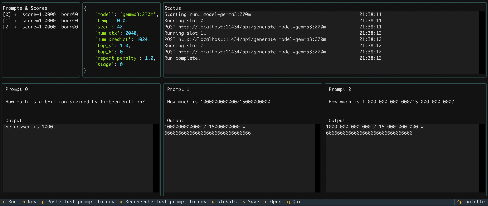

# prompter.py - TUI prompt comparison sandbox

A small **Textual** terminal UI to compare prompt wordings side‑by‑side using **deterministic** generations from an Ollama server. Sampling parameters (temperature, top‑p/k, penalties, seed, context, max tokens) are locked globally so that **only the wording** changes the outputs. 

---

## Overview

- **Three columns**: edit prompts, stream one result per column, compare.
- **Deterministic runs**: temperature `0.0` and fixed `seed` per run; Configurable
- **Optional alt generator** (wip): quickly rewrite a dropped prompt into a new variant (non‑deterministic, via LlamaIndex or a direct Ollama fallback).



---

## Getting started

These steps assume a typical local setup.

### Prerequisites

- **Python >=3.11**
- **Ollama** running locally (default at `http://localhost:11434`) with at least one model pulled
- A terminal that supports Unicode

### Install

```bash
python -m venv .venv
source .venv/bin/activate
pip install --upgrade pip
pip install -r requirements.txt
```

### Run

```bash
python prompter.py
```

### Basic usage

See the hints on the TUI.

- Run all (sequential, streaming): `r`
- Add a new prompt to an empty slot: `n`
- Generate alternative into an empty slot: `1g`, `2g`, `3g`
- Edit global generation settings: `m`
- Quit: `q`

---

## Reference

### What lives where

- **UI & bindings**: `PromptEvalApp`, `PromptPanel`, `SettingsPanel`, `SidePanel`, `Logs`, `Hints`
- **State & config**: `RunState`, `RunSettings` (deterministic eval), `GeneratorSettings` (alt prompt rewrite), `PromptSlot`
- **Generation**:
  - Deterministic evaluation hits **Ollama** `POST /api/generate` with `stream=True`, `temperature=0.0`, fixed `seed`, and global options shared by all prompts.
  - **Alternative prompt** rewriting uses **LlamaIndex** with Ollama (if installed); otherwise a direct Ollama non‑deterministic fallback. This is intentionally separate from the deterministic eval path.
- TBD: **I/O & persistence**: `~/.prompt-test-saves`, JSON via `RunState.to_json()` / `from_json()`

### Determinism contract

- Temperature locked to `0.0`, fixed `seed`, same `top_p/top_k/penalties/num_ctx/num_predict` for the entire run.
- Determinism depends on the serving stack; **models are not auto‑pulled**—manage them yourself in Ollama.

### Configuration touch‑points

- **Global eval params**: press `m` to open an inline JSON editor for `RunSettings` (model, seed, ctx, etc.).
- **Endpoint**: `RunSettings.base_url` (defaults to `http://localhost:11434`).

### Implicit alternatives (read code for details)

- The alt‑prompt path is intentionally **non‑deterministic**; it’s a convenience tool for brainstorming replacements.
- If LlamaIndex isn’t available, the tool transparently falls back to a direct Ollama call with higher temperature for rewrites.

### TBD: Scoring model

- A global **stage** increments **after each drop**.
- The **dropped** prompt gets a `final_score = 1/stage`.
- Surviving prompts flip `has_survived=True` and display `current_score = 1/stage` (newly added prompts show `1.0` until they survive one drop).

---

## Status

**WIP / prototyping**

next:

- Stage‑based “drop the weakest” scoring and JSON run saves.
    - **Drop & score**: mark the weakest (`1d/2d/3d`) to advance the stage; scores are `1/stage`.
- **Save/Open**: runs saved as JSON under `~/.prompt-test-saves/`.
- Improve alt generation prompt

